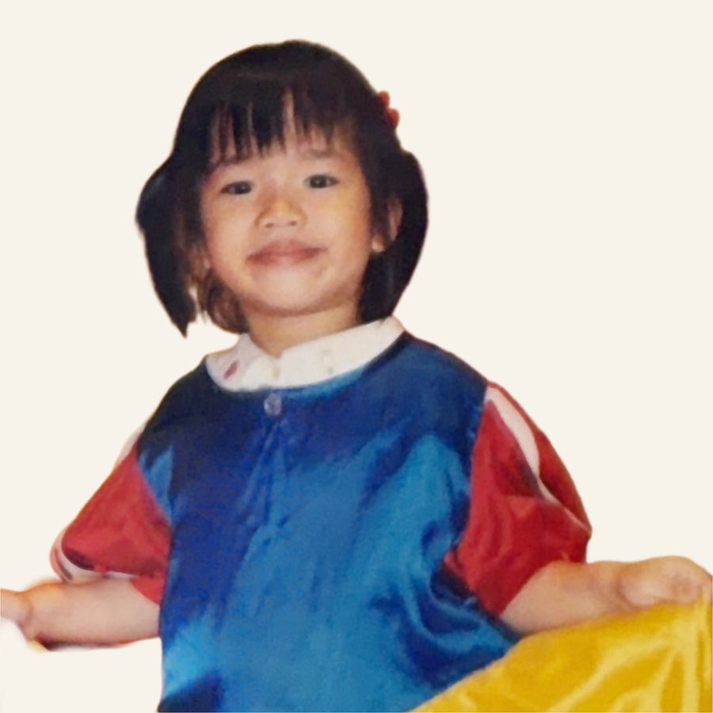
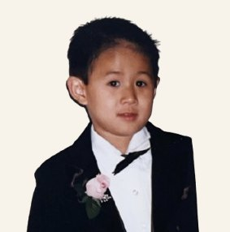
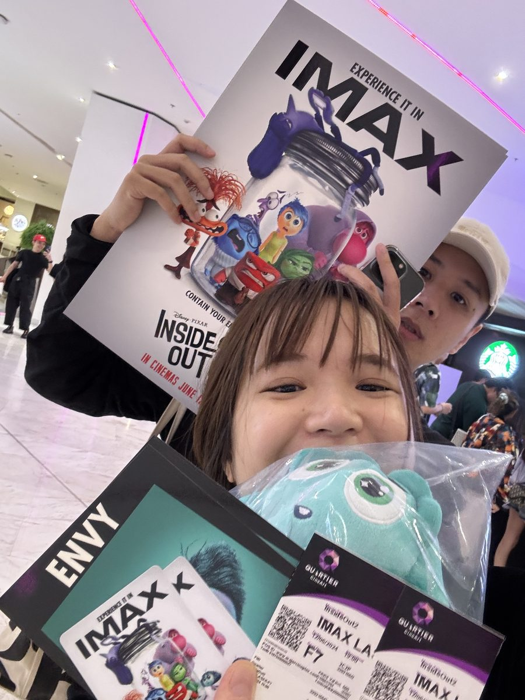

# Photo Checklist

All photos go in the `images/` folder. The HTML is already wired up — just drop the file in with the right name and it appears automatically (except for the couple card slots, which need one small edit).

---

## 1. Hero Background — Already Wired ✓

The full-screen background behind your names on the opening section.

**File name:** `images/couple.png` (jpg or webp also works — just rename accordingly)

**What to add:** A beautiful photo of the two of you together. Landscape orientation works best since it covers the full screen. It sits behind a very light peach veil so text stays readable — a photo with some open/soft areas works better than a very busy one.

**No code edit needed** — just drop `couple.png` into the `images/` folder and it will appear.

> If you use a different format (e.g. jpg), find `images/couple.png` in `index.html` (line ~1606) and change the extension to match.

---

## 2. Couple Section — Childhood Photos

Each card front has a small circular slot waiting for a photo.

**What to add:** One childhood photo of Nine, one of Tom. Candid and fun — the more personality the better.

**Where to put the files:** `images/nine-kid.jpg` and `images/tom-kid.jpg`

**How to wire them in** — open `index.html` and search for `couple-photo-slot`. You'll find two of them. Edit each one:

For Nine's card:
```html
<!-- BEFORE (empty slot) -->
<div class="couple-photo-slot"></div>

<!-- AFTER (with photo) -->
<div class="couple-photo-slot">
  
</div>
```

For Tom's card:
```html
<!-- BEFORE (empty slot) -->
<div class="couple-photo-slot"></div>

<!-- AFTER (with photo) -->
<div class="couple-photo-slot">
  
</div>
```

The photo is automatically cropped into a circle — no extra work needed.

---

## 3. Our Story — Photo Deck

The scroll deck has 10 photo slots currently showing placeholder colors.

**Where to put the files:** `images/story-1.jpg` through `images/story-10.jpg`

**No code edit needed** — just add the files with those exact names and they appear automatically.

> If the deck photos are already wired differently (check `index.html` for `deck-photo` elements), add an `` inside each one:
> ```html
> <div class="deck-photo photo-drop" style="...">
>   
> </div>
> ```

**Photo tips:**
- Portrait orientation (taller than wide) fills the cards best
- Candid moments work great — trips, everyday life, the proposal
- Chronological order tells your story nicely but isn't required

---

## Quick Reference

| Section | File name | Code edit needed? |
|---|---|---|
| Hero background | `images/couple.png` | No — just drop the file in |
| Nine's childhood circle | `images/nine-kid.jpg` | Yes — add `` inside `couple-photo-slot` |
| Tom's childhood circle | `images/tom-kid.jpg` | Yes — add `` inside `couple-photo-slot` |
| Our Story photo 1 | `images/story-1.jpg` | Check if `` already inside `deck-photo` |
| Our Story photos 2–10 | `images/story-2.jpg` … `images/story-10.jpg` | Same as above |
